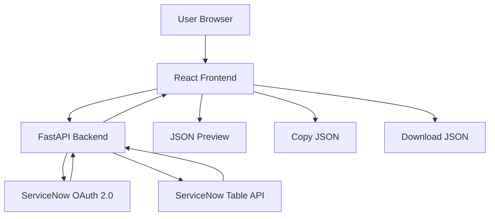

# ServiceNow JSON Data Exporter

A full-stack web application that securely connects to a ServiceNow instance through OAuth 2.0 and dynamically exports accessible ServiceNow table data as JSON.

The application lets a user discover ServiceNow tables, select a single table, dynamically load its fields (including inherited fields), choose fields to export, build filters, sort records, fetch records with pagination, normalize ServiceNow reference values, preview the JSON, copy it, or download the complete dataset.

## Live Deployment

| Component | URL |
|---|---|
| Frontend | https://servicenow-json-exporter-1.onrender.com |
| Backend API | https://servicenow-json-exporter.onrender.com |
| GitHub | https://github.com/Devbrat-Singh/ServiceNow-JSON-Exporter |

> **Current login flow:** the deployed backend currently handles OAuth login separately. Open `https://servicenow-json-exporter.onrender.com/login`, complete ServiceNow authorization, and then open the frontend URL. Automatic frontend-to-login redirection can be added as a future improvement.

## Why This Project

ServiceNow data is normally consumed through ServiceNow's own UI or API clients. This project provides an external, reusable interface for selecting a table and exporting the records that the authenticated ServiceNow user is allowed to access.

The project focuses on:

- Dynamic table discovery instead of hardcoded tables
- Dynamic field discovery instead of hardcoded schemas
- Support for inherited ServiceNow fields such as fields inherited from `task`
- Visual filtering with AND/OR logic
- Sorting and pagination
- JSON normalization for reference fields
- OAuth 2.0 authentication
- Sensitive-field export protection
- A React-based user interface
- FastAPI backend integration with the ServiceNow Table API

## Features

### 1. OAuth 2.0 Authentication

The backend uses ServiceNow OAuth 2.0 Authorization Code flow.

The flow is:

```text
User
  |
  v
FastAPI /login
  |
  v
ServiceNow OAuth Authorization
  |
  v
Authorization Code + State
  |
  v
FastAPI /auth/callback
  |
  v
ServiceNow /oauth_token.do
  |
  v
Access Token + Refresh Token
```

The OAuth application is configured as a private/integration client with a read-only `table_read` scope.

### 2. Dynamic Table Discovery

The backend dynamically discovers tables using ServiceNow metadata APIs rather than maintaining a hardcoded table list.

The UI supports searching for tables such as:

```text
incident
task
sys_user
```

### 3. Dynamic Field Discovery

After a table is selected, the backend reads the table's dictionary metadata and walks the table inheritance hierarchy.

For example, an `incident` table can expose inherited fields from its parent table, including common task fields.

### 4. Field Selection

Users can:

- Search fields
- Select individual fields
- Select all visible fields
- Clear the selection
- Export only the selected fields

Sensitive fields are blocked by the backend and protected in the frontend.

### 5. Visual Filter Builder

The application supports the following filter operators:

| Operator | Description |
|---|---|
| `is` | Exact match |
| `is_not` | Not equal |
| `contains` | Contains text |
| `starts_with` | Starts with text |
| `ends_with` | Ends with text |
| `is_empty` | Field is empty |
| `is_not_empty` | Field is not empty |

Filters can be combined with:

```text
AND
OR
```

Example:

```text
priority is 1
AND
short_description is not empty
```

This becomes a ServiceNow encoded query similar to:

```text
priority=1^short_descriptionISNOTEMPTY
```

### 6. Sorting

Records can optionally be sorted by any available field.

Supported directions:

```text
Ascending
Descending
```

Example:

```text
ORDERBYnumber
ORDERBYDESCnumber
```

### 7. Pagination

The backend fetches ServiceNow records in pages instead of requesting the entire dataset in one API call.

The advanced export endpoint currently uses a page size of 500 records and continues until the final page is reached.

### 8. JSON Normalization

ServiceNow reference fields can contain structured values such as display values and sys_ids.

The backend normalizes these values so the exported JSON is easier to consume.

Example:

```json
{
  "caller_id": "Fred Luddy",
  "assignment_group": "Service Desk",
  "priority": "1 - Critical"
}
```

Instead of exposing the raw ServiceNow reference object.

### 9. Large Dataset Handling

The frontend preview is intentionally limited to the first 100 records to keep the browser interface responsive.

The **Copy JSON** and **Download JSON** actions still operate on the complete exported dataset returned by the backend.

> The current implementation keeps the complete export in backend memory. True streaming export is a possible future enhancement.

### 10. Sensitive Field Protection

The backend prevents known sensitive fields from being exported, filtered, or used for sorting.

Examples include:

```text
password
user_password
password_hash
api_key
access_token
refresh_token
client_secret
private_key
secret_key
```

Pattern-based checks also block field names containing sensitive terms such as `password`, `client_secret`, `access_token`, and `refresh_token`.

ServiceNow permissions still remain the underlying authorization boundary; the application adds an additional application-level protection layer.

## Architecture



### Detailed Export Flow

```text
User
  |
  v
React Frontend
  |
  +--> OAuth Login
  |       |
  |       v
  |   ServiceNow PDI
  |       |
  |       v
  |   Access Token
  |
  v
FastAPI Backend
  |
  +--> Dynamic Table Discovery
  |
  +--> Table Selection
  |
  +--> Dynamic Field Discovery
  |
  +--> Field Selection
  |
  +--> Filter Builder
  |
  +--> Sorting
  |
  v
ServiceNow Table API
  |
  v
Paginated Records
  |
  v
JSON Normalization
  |
  v
JSON Response
  |
  +--> Preview
  +--> Copy
  +--> Download
```

## Technology Stack

### Frontend

- React
- Vite
- JavaScript / JSX
- CSS

### Backend

- Python
- FastAPI
- Uvicorn
- HTTPX
- Pydantic
- python-dotenv

### Integration

- ServiceNow OAuth 2.0
- ServiceNow Table API
- ServiceNow metadata APIs (`sys_db_object`, `sys_dictionary`)

### Deployment

- GitHub for source control
- Render Web Service for FastAPI
- Render Static Site for React frontend

## Project Structure

```text
ServiceNow-JSON-Exporter/
│
├── backend/
│   ├── main.py
│   ├── oauth.py
│   ├── config.py
│   ├── requirements.txt
│   ├── .env.example
│   └── .gitignore
│
├── frontend/
│   ├── src/
│   │   ├── App.jsx
│   │   ├── App.css
│   │   ├── index.css
│   │   └── main.jsx
│   ├── public/
│   ├── package.json
│   ├── package-lock.json
│   ├── vite.config.js
│   └── .env.example
│
└── .gitignore
```

> `backend/venv/`, `__pycache__/`, `node_modules/`, `.env`, and build output are intentionally excluded from Git.

## Backend API Endpoints

### Authentication

| Method | Endpoint | Purpose |
|---|---|---|
| GET | `/login` | Starts ServiceNow OAuth login |
| GET | `/auth/callback` | Handles the OAuth callback and token exchange |

### Table Discovery

| Method | Endpoint | Purpose |
|---|---|---|
| GET | `/tables` | Returns accessible/discovered tables |
| GET | `/tables/search?query=incident` | Searches tables |

### Field Discovery

| Method | Endpoint | Purpose |
|---|---|---|
| GET | `/fields/{table_name}` | Returns fields for a table, including inherited fields |

### Export

| Method | Endpoint | Purpose |
|---|---|---|
| GET | `/export/{table_name}` | Legacy/basic export endpoint |
| POST | `/export/{table_name}/advanced` | Advanced export with fields, filters, logic, sorting, and pagination |

### Other

| Method | Endpoint | Purpose |
|---|---|---|
| GET | `/` | Backend health/root response |
| GET | `/test/incident` | Simple incident API test endpoint |

## Advanced Export Request

Example request:

```json
{
  "fields": [
    "number",
    "priority",
    "short_description",
    "caller_id",
    "assignment_group"
  ],
  "filters": [
    {
      "field": "priority",
      "operator": "is",
      "value": "1"
    }
  ],
  "logic": "AND",
  "order_by": "number",
  "order_direction": "DESC"
}
```

The backend converts this into a ServiceNow encoded query and returns normalized JSON records.

## Response Example

```json
{
  "table": "incident",
  "count": 28,
  "selected_fields": [
    "number",
    "priority",
    "short_description",
    "caller_id",
    "assignment_group"
  ],
  "filters": [
    {
      "field": "priority",
      "operator": "is",
      "value": "1"
    }
  ],
  "logic": "AND",
  "order_by": "number",
  "order_direction": "DESC",
  "encoded_query": "priority=1^ORDERBYDESCnumber",
  "records": [
    {
      "number": "INC0010014",
      "short_description": "E-Commerce Support Request SUP0001017 - Delivery Delay",
      "assignment_group": "Service Desk",
      "caller_id": "Aarav Sharma",
      "priority": "1 - Critical"
    }
  ]
}
```

## Local Development Setup

### Prerequisites

Install:

- Python 3.x
- Node.js and npm
- Git
- A ServiceNow instance/PDI
- A ServiceNow OAuth Application Registry entry

### 1. Clone the Repository

```bash
git clone https://github.com/Devbrat-Singh/ServiceNow-JSON-Exporter.git
cd ServiceNow-JSON-Exporter
```

### 2. Configure the Backend

Create a virtual environment:

```powershell
cd backend
python -m venv venv
```

Activate it on Windows:

```powershell
venv\Scripts\activate
```

Install dependencies:

```powershell
pip install -r requirements.txt
```

Create `backend/.env` from the example file.

Example:

```env
SERVICENOW_INSTANCE=https://your-instance.service-now.com
SERVICENOW_CLIENT_ID=your_client_id
SERVICENOW_CLIENT_SECRET=your_client_secret
SERVICENOW_REDIRECT_URI=http://localhost:8000/auth/callback
CORS_ORIGINS=http://localhost:5173
```

### 3. Configure ServiceNow OAuth

Create or configure an OAuth Application Registry record with values matching your environment.

For local development, the redirect URI should be:

```text
http://localhost:8000/auth/callback
```

The application uses a `table_read` OAuth scope for read-only access to ServiceNow Table API resources.

### 4. Start the Backend

From the `backend` directory:

```powershell
uvicorn main:app --reload
```

Backend:

```text
http://localhost:8000
```

### 5. Start the Frontend

Open a second terminal:

```powershell
cd frontend
npm install
npm run dev
```

Frontend:

```text
http://localhost:5173
```

For Vite, configure the frontend API base URL using:

```env
VITE_API_BASE_URL=http://localhost:8000
```

## Production Deployment

The project is deployed on Render as two separate services.

### Backend - Render Web Service

Repository:

```text
Devbrat-Singh/ServiceNow-JSON-Exporter
```

Settings:

```text
Branch: main
Root Directory: backend
Build Command: pip install -r requirements.txt
Start Command: uvicorn main:app --host 0.0.0.0 --port $PORT
```

Production environment variables:

```env
SERVICENOW_INSTANCE=https://your-instance.service-now.com
SERVICENOW_CLIENT_ID=your_client_id
SERVICENOW_CLIENT_SECRET=your_client_secret
SERVICENOW_REDIRECT_URI=https://servicenow-json-exporter.onrender.com/auth/callback
CORS_ORIGINS=https://servicenow-json-exporter-1.onrender.com
```

### Frontend - Render Static Site

Settings:

```text
Branch: main
Root Directory: frontend
Build Command: npm ci && npm run build
Publish Directory: dist
```

Frontend environment variable:

```env
VITE_API_BASE_URL=https://servicenow-json-exporter.onrender.com
```

## Security Considerations

### Secrets

Never commit real credentials.

Do not place real values in:

```text
backend/.env.example
frontend/.env.example
README.md
GitHub source files
```

Use placeholders such as:

```env
SERVICENOW_CLIENT_SECRET=your_client_secret
```

The real `.env` file is ignored by Git.

### OAuth

The backend validates the OAuth `state` value before exchanging the authorization code.

The OAuth state is single-use in the current implementation.

### Token Storage

The current backend stores access and refresh tokens in process memory.

This is suitable for the current single-instance deployment but is not a full production session-management architecture. A restart or sleep cycle can clear the in-memory token state and require a new login.

### ServiceNow Authorization

The application uses the OAuth identity and permissions of the authenticated ServiceNow user. ServiceNow remains responsible for the underlying table and record access controls.

## Error Handling

The backend maps common ServiceNow/API failures to clearer HTTP errors, including:

- `400` invalid request
- `401` authentication failure or expired token
- `403` access denied
- `404` resource not found
- `429` rate limit reached
- `502` upstream ServiceNow server error or connection failure
- `504` request timeout

## Current Limitations

1. OAuth tokens are stored in memory.
2. A Render restart/sleep can require a new OAuth login.
3. The current frontend requires the backend login URL to be visited before the app can use the authenticated backend session.
4. Complete export data is kept in backend memory rather than streamed directly to the browser.
5. Sensitive-field protection is based on field-name rules and ServiceNow access permissions.
6. The application is currently designed around exporting one selected table per export operation.

## Future Improvements

Potential next improvements include:

- Automatic frontend redirect to the backend OAuth login flow
- Secure server-side session storage using Redis or a database
- Multi-user session management
- Streaming exports for very large datasets
- Background export jobs for very large tables
- Export history and job status tracking
- Scheduled exports
- CSV export in addition to JSON
- ZIP/compressed export for large datasets
- More granular field metadata and data-type aware filter controls
- Better production observability and audit logging

## Example Use Case

A user wants to export critical incidents from ServiceNow.

They can configure:

```text
Table:
incident

Fields:
number
priority
short_description
caller_id
assignment_group

Filter:
priority is 1

Sort:
number descending
```

The application generates a ServiceNow query such as:

```text
priority=1^ORDERBYDESCnumber
```

and returns the matching records as normalized JSON.

## Development Notes

The application intentionally uses ServiceNow metadata APIs instead of hardcoding individual tables and fields. This allows the same frontend to work across multiple ServiceNow tables without changing the React UI for each schema.

The backend is responsible for:

- Authentication
- ServiceNow API calls
- Metadata discovery
- Query construction
- Pagination
- Normalization
- Sensitive-field validation
- Error handling

The frontend is responsible for:

- User interaction
- Table and field selection
- Search
- Filter and sorting controls
- Export status
- JSON preview
- Copy/download actions

## Author

**Devbrat Singh**

ServiceNow Developer Trainee at Cloud Analogy

GitHub: https://github.com/Devbrat-Singh

## License

No license is currently specified for this repository.

If you intend others to reuse or redistribute the project, add an appropriate open-source license to the repository.
